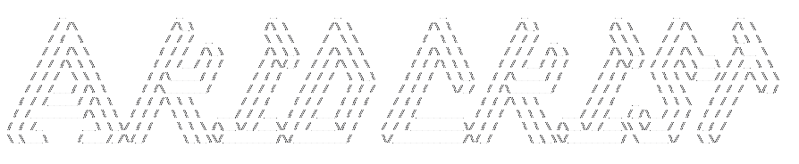

  

  <!-- Typing SVG by DenverCoder1 - https://github.com/DenverCoder1/readme-typing-svg -->
  

<!-- Social icons section -->

  
  &nbsp;&nbsp;&nbsp;&nbsp;
  
  &nbsp;&nbsp;&nbsp;&nbsp;
  
  &nbsp;&nbsp;&nbsp;&nbsp;
  
  &nbsp;&nbsp;&nbsp;&nbsp;
  

 

<!-- Social badges section -->
<!-- Badges with custom icons - https://github.com/DenverCoder1/custom-icon-badges -->
<!-- View counter - https://github.com/DenverCoder1/Simple-View-Counter -->

&nbsp;&nbsp;
&nbsp;&nbsp;

 

 
  
<h2>📘 My Top Open Source Projects</h2>

  <!-- Repo info cards - https://github.com/anuraghazra/github-readme-stats -->
  <!-- Small repo cards (fork) - https://github.com/DenverCoder1/github-readme-stats -->
  

    
    
    
    
    
    
    
    
    
  

  

 
  
<h2>📕 Top Projects I've Contributed To</h2>

  <!-- Small repo cards https://github.com/DenverCoder1/github-readme-stats -->
  

    
    
  

 
  
<h2>📺 Latest YouTube Videos</h2>

  <!-- YouTube Cards - https://github.com/DenverCoder1/github-readme-youtube-cards -->

  <!-- prettier-ignore-start -->
<!-- BEGIN YOUTUBE-CARDS -->

<!-- END YOUTUBE-CARDS -->
  <!-- prettier-ignore-end -->
  

 
  
<h2>🛠️ My Favorite Tools</h2>

  <!-- Some badges are from https://github.com/Ileriayo/markdown-badges -->

  <h3>👨‍💻 Programming and Markup Languages</h3>

  

      
      
      
      
      
      
      
      
      
      
      
      
      
      
      
      
      
      
  

<h3>🧰 Frameworks and Libraries</h3>

  

      
      
      
      
      
      
      
      
      
      
      
      
      
      
      
      
      
      
      
  

  <h3>🗄️ Databases, Cloud Hosting And Domain Registrars</h3>

  <h4>Databases</h4>
  

      
      
      
      
      
  

  <h4>Vector Databases</h4>
  

      
      
      
      
      
  

  <h4>Cloud & Hosting Platforms</h4>
  

      
      
      
  

  <h4>Hosting Platforms (Vietnam)</h4>
  

      
      
      
      
      
      
  

  <h4>Hosting Platforms (World)</h4>
  

      
      
      
      
      
      
      
      
      
  

  <h4>Domain Registrars</h4>
  

      
      
      
      
      
      
      
  

  <h3>💻 Software and Tools</h3>

  

      
      
      
      
      
      
      
      
      
      
      
      
      
      
      
      
      
      
      
      
      
      
      
      
      
      
  

  
<h2>🤖 My Favorite AI</h2>

  <h3>Large Language Models</h3>
  

      
      
      
      
      
      
      
      
  

  <h3>AI Agents & Tools</h3>
  

      
      
      
      
      
      
  

 
  
<h2>📊 Stats and Activity</h2>

  <h3>🔥 Streak Stats</h3>

  <!-- GitHub Readme Streak Stats - https://github.com/DenverCoder1/github-readme-streak-stats -->
  

    
    
🔥 Get streak stats for your profile at <a href="https://git.io/streak-stats">git.io/streak-stats</a>

  

  <h3>💻 GitHub Profile Stats</h3>

  <!-- https://github.com/anuraghazra/github-readme-stats -->

  
  
   

  <b>Note:</b> Top languages is only a metric of the languages my public code consists of and doesn't reflect experience or skill level.
  
  <!-- https://github.com/ashutosh00710/github-readme-activity-graph -->

  

 
  
<h2>🏷️ Holopin Badges</h2>

  

  
> *"𝑨𝒏𝒚𝒐𝒏𝒆 𝒄𝒂𝒏 𝒑𝒓𝒆𝒅𝒊𝒄𝒕 𝒕𝒉𝒆 𝒇𝒖𝒕𝒖𝒓𝒆... 𝑨 𝒗𝒊𝒔𝒊𝒐𝒏𝒂𝒓𝒚 𝒔𝒉𝒂𝒑𝒆𝒔 𝒊𝒕."*  
> — Isaac Asimov

